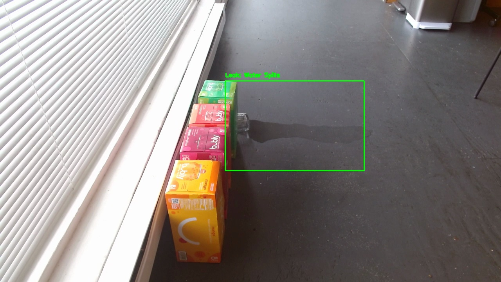
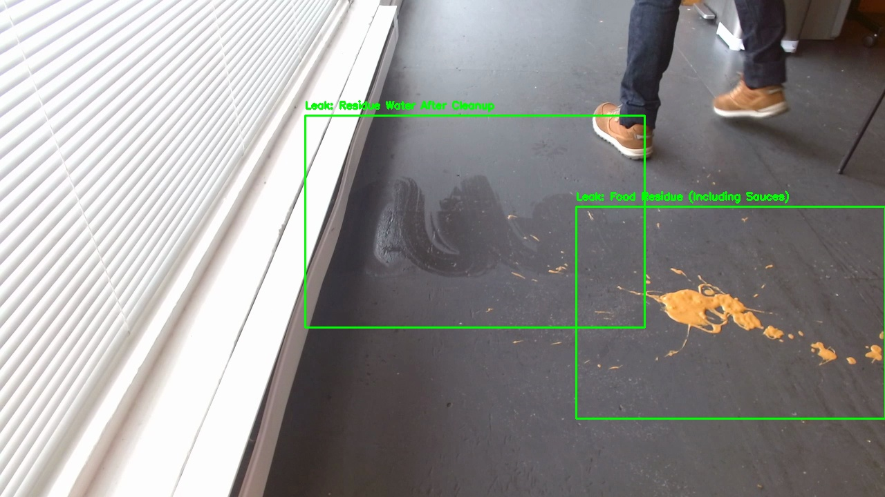

# Leak Detection Demo
Sample code for leak detection using FrameGrab and Groundlight ML services




## Running the Script

You can install all the necessarily dependencies with `poetry` or `pip`

```bash
poetry install
```

```bash
pip install -r requirements.txt
```

### Configuring the Script

The script requires three detectors to run:
- Binary Detector `detect_leaks`: `Is there a leak or spill on the floor?`
- Counting Detector `count_leaks`: `Label each leak or spill in the image`
- Multi-class Detector `classify_leaks`: `What types of spill or leak is this?`

In the example, we used the following classes for `classify_leaks` detector:
1. Water Spills
2. Residue Water After Cleanup
3. Food Residue (Including Sauces)
4. Other

After creating the detectors, modify the yaml file in `configs/config.yaml` to include the detector IDs. You can also configure other settings inside the yaml file.

- `endpoint`: Specify the edge-endpoint address, default `https://api.groundlight.ai` to use cloud
- `detect_leaks`: Binary detector ID to detect is there a leak or spill
- `count_leaks`: Counting detector ID to count and obtain the bounding boxes for all the leaks in the image
- `classify_leaks`: Multi-class detector ID to classify what types of spills or leaks
- `enable_motion_detection`: Enable motion detection
- `motion_detection_threshold`: Set the percentage of minimum pixels required to trigger a motion detection

```yaml
endpoint: "https://api.groundlight.ai"
leak_detector_ids:
  detect_leaks: "det_"
  count_leaks: "det_"
  classify_leaks: "det_"
enable_motion_detection: false
motion_detection_threshold: 0.1
```

### Configuring the Camera

The sample script uses `FrameGrab` to get frames from a variety of sources. The configuration file can be found and configured in `configs/camera.yaml`. Please refer to the `FrameGrab` documentation [here](https://pypi.org/project/framegrab/) of how to configure the camera.

After the modify the configuration files, the script can be ran with the following command:

Poetry
```bash
poetry run python detect_leak.py
```

Pip
```bash
python detect_leak.py
```